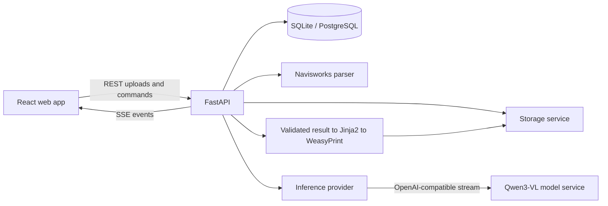

# Architecture

The browser uses REST for state-changing commands and Server-Sent Events for inference output. The API owns all trusted report metadata and only asks the model for visually inferred fields.

## Boundaries

- Routes translate HTTP contracts only.
- Repositories contain database queries.
- `HtmlParser` returns versioned normalized records and row-level errors.
- `StorageService` is the only component that chooses filesystem paths.
- `InferenceProvider` isolates mock and OpenAI-compatible model backends.
- `AnalysisNormalizer` discards model-provided trusted metadata and derives severity in the backend.
- `ReportRenderer` renders only escaped, validated values and rejects remote URL fetching.

SQLite enables WAL and foreign keys for the MVP. Model, adapter, prompt, parser, and severity-rule versions are stored with each generated result.
